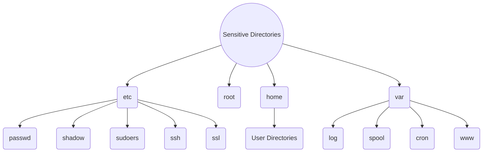

# 🟦 Sensitive Files

Sensitive directories in the Linux file system often contain critical system configuration files, user data, and sensitive information. Access to these directories should be tightly controlled to prevent unauthorized access or modification. Here are some of the most sensitive directories in Linux:

1. **/etc**: This directory contains system-wide configuration files. It includes sensitive files such as:
   * /etc/passwd: Contains user account information.
   * /etc/shadow: Stores user passwords in encrypted form.
   * /etc/sudoers: Configuration file for sudo privileges.
   * /etc/ssh/: Contains SSH configuration files.
   * /etc/ssl/: Contains SSL/TLS certificate files.
2. **/root**: The home directory for the root user (superuser). It contains sensitive system-related files and configuration settings.
3. **/home**: This directory contains user home directories, where sensitive user data and configuration files are stored. Each user's home directory may contain private files, SSH keys, and configuration settings.
4. **/var/log**: Contains system log files, including security-related logs such as authentication attempts and system events. Sensitive information in log files may include user activity, system errors, and security incidents.
5. **/var/spool/mail**: Stores user mailbox files for local mail delivery. These files contain sensitive email communications and messages.
6. **/var/spool/cron**: Contains cron job files for scheduled tasks and automation. Cron jobs may include commands with elevated privileges or sensitive data.
7. **/usr/local/bin**: Contains locally-installed executables and scripts. These files may include custom applications or scripts with sensitive functionality.
8. **/tmp**: A directory for temporary files. It is common for sensitive data to be temporarily stored here, so access to this directory should be restricted.
9. **/proc**: A virtual filesystem that provides information about system processes and kernel settings. While not containing files in the traditional sense, it can expose sensitive information about system state and configuration.
10. **/var/www**: Default directory for web server files. Contains web application files, configuration files, and potentially sensitive user data.

It's crucial to secure these directories by setting appropriate file permissions, restricting access to privileged users, and regularly monitoring for unauthorized access or modifications. Additionally, encrypting sensitive data at rest and in transit can provide an extra layer of security for critical information stored in these directories.

