# Linux File System

* **Root Directory (/)**: The root directory is the top-level directory in the Linux file system hierarchy. It is denoted by a forward slash (/) and serves as the starting point for all other directories and files on the system.
* **Standard Directories**: Linux systems typically include several standard directories for organizing files and data:
  * **/bin**: Contains essential executable binaries (programs) needed for system boot and maintenance, such as shell commands and system utilities.
  * **/boot**: Contains boot loader files, kernel images, and other files needed for booting the operating system.
  * **/dev**: Contains device files representing hardware devices and system resources, allowing interaction with hardware devices through the file system.
  * **/etc**: Contains system configuration files and settings used by various system components and applications.
  * **/home**: Contains user home directories, where users store their personal files and configuration settings.
  * **/lib** and **/lib64**: Contains shared libraries (dynamic link libraries) needed by executable programs at runtime.
  * **/mnt**: Mount point for temporary file systems or storage devices mounted manually by the system administrator.
  * **/opt**: Contains optional software packages or applications installed by the system administrator.
  * **/proc**: Contains virtual files and directories that represent system processes and kernel runtime information.
  * **/root**: Home directory for the root user (superuser) account.
  * **/sbin**: Contains system binaries (programs) primarily used for system administration tasks, such as system startup, shutdown, and maintenance.
  * **/tmp**: Directory for temporary files created by system processes and applications. Contents are typically deleted upon system reboot.
  * **/usr**: Contains user binaries, libraries, documentation, and other files not essential for system boot or maintenance.
  * **/var**: Contains variable data files such as logs, spool files, and temporary files created by system services and applications.

```mermaid
graph LR;
    A((Root Directory)) --> B(bin)
    A --> C(boot)
    A --> D(dev)
    A --> E(etc)
    A --> F(home)
    A --> G(lib)
    A --> H(lib64)
    A --> I(mnt)
    A --> J(opt)
    A --> K(proc)
    A --> L(root)
    A --> M(sbin)
    A --> N(tmp)
    A --> O(usr)
    A --> P(var)
    O --> Q(bin)
    O --> R(include)
    O --> S(lib)
    O --> T(local)
    O --> U(sbin)
    O --> V(src)
    P --> W(cache)
    P --> X(log)
    P --> Y(mail)
    P --> Z(spool)

    %% Bin contents
    B --> B1(executable files)
    %% Boot contents
    C --> C1(kernel images)
    %% Dev contents
    D --> D1(device files)
    %% Etc contents
    E --> E1(configuration files)
    %% Home contents
    F --> F1(user directories)
    %% Lib contents
    G --> G1(shared libraries)
    H --> H1(64-bit shared libraries)
    %% Mnt contents
    I --> I1(mount points)
    %% Opt contents
    J --> J1(optional software)
    %% Proc contents
    K --> K1(system process info)
    %% Root contents
    L --> L1(root user home)
    %% Sbin contents
    M --> M1(system binaries)
    %% Tmp contents
    N --> N1(temporary files)
    %% Usr contents
    O --> O1(user binaries)
    O --> O2(library files)
    O --> O3(include files)
    O --> O4(local software)
    O --> O5(system binaries)
    O --> O6(source code)
    %% Var contents
    P --> P1(variable data)
    P --> P2(cache)
    P --> P3(logs)
    P --> P4(mail)
    P --> P5(spool)

```

