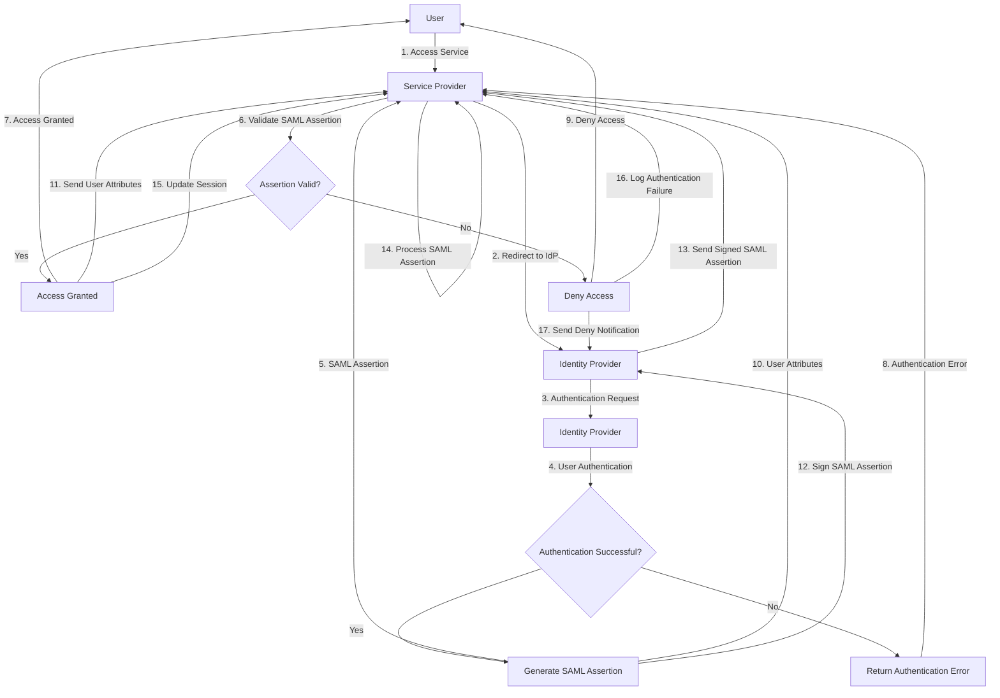

# 🟧 SAML

```mermaid
graph TD;
    A[User] -->|1. Access Service| B[Service Provider];
    B -->|2. Redirect to IdP| C[Identity Provider];
    C -->|3. Authentication Request| D[Identity Provider];
    D -->|4. User Authentication| E{Authentication Successful?};
    E -->|Yes| F[Generate SAML Assertion];
    E -->|No| G[Return Authentication Error];
    F -->|5. SAML Assertion| B;
    B -->|6. Validate SAML Assertion| H{Assertion Valid?};
    H -->|Yes| I[Access Granted];
    H -->|No| J[Deny Access];
    I -->|7. Access Granted| A;
    G -->|8. Authentication Error| B;
    J -->|9. Deny Access| A;
    F -->|10. User Attributes| B;
    I -->|11. Send User Attributes| B;
    F -->|12. Sign SAML Assertion| C;
    C -->|13. Send Signed SAML Assertion| B;
    B -->|14. Process SAML Assertion| B;
    I -->|15. Update Session| B;
    J -->|16. Log Authentication Failure| B;
    J -->|17. Send Deny Notification| C;

```
